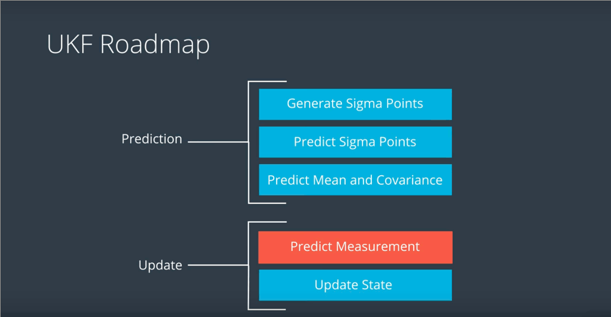
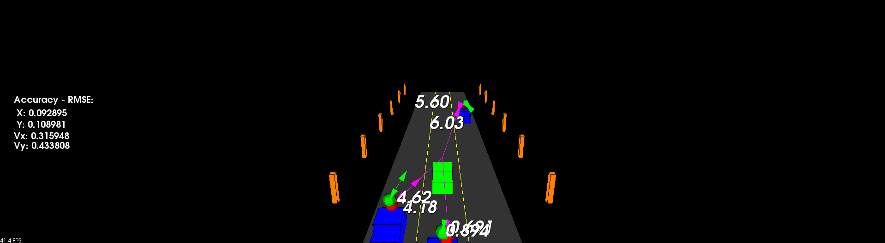

# SFND Unscented Kalman Filter Project Submission


## Introduction

This readme provides further information on my solution to the Sensor Fusion Nanadegree Kalman Filter project.

The program is written in C++, and utilises a the Udacity provided simulator that is integated into the code built on the PCM framework.


## Build and execution

The solution can be built by running the following in a terminal from the top level directory:

```
mkdir build
cd build
cmake ..
make   
```

The solution can then be executed with
```
./ukf_highway
```

## Notes on implementation

Having previously completed the Self Driving Car Nanodegree, I found that I had already completed all lessons of the Kalman filter section as part of that course. (The lessons are identical in both courses).

The project is scenario is different and utilises a different simulator, but requires the implementation of the Kalman Filter as before and based on the same lessons as the SDCND. The nature of the Kalman Filter provides the methods to predict and track motion, and does not care about the problem it is solving, so my solution to the SFND project is based on my solution the the UKF project on the SDCND.
The original soltion can be found at: https://github.com/Geordio/CarND-Unscented-Kalman-Filter-Project

I compared the skeleton code against my previous solution and checked that the methods and arguments were they same. It was then a simple case of poulating the methods in the skeleton code with mine from the SDCND.

The solution implements the UKF as per the roadmap below:
   

Initially the RMSE value exceeded the threshold after less than 1 second.
After investigation I determined that I needed to tune the process noise for longitudinal and yaw acceleration.
Unfortunately regardless of value, I could still not get the RMSE to stay within tolerance. I refered to the Udacity Knowledge system and found topic https://knowledge.udacity.com/questions/62841 which suggested:
"The best way to start is with the identity matrix. Then if you need you can go with square of the standard deviation values of each sensor in last two elements of the diagonal of the matrix." Mentor Vidyasagar J

Until this point my P covarinace matrix was a 5x5 Identy matrix.

I updated my code to implement the solution proposed by the mentor:
``` cpp
P_ << 1, 0, 0, 0, 0,
    0, 1, 0, 0, 0,
    0, 0, 1, 0, 0,
    0, 0, 0, std_laspx_ * std_laspx_, 0,
    0, 0, 0, 0, std_laspy_ * std_laspy_;

```

Following this, the UKF performed correctly and stayed withing RMSE tolerance.

## Performance

The animated gif below shows the performance.


It can be seen that there are no errors, and the ukf performs correctly in the scenario from start to end.


## Summary of Rubric points
| Rubric Point | Definition                    | Solution                                                                                                                    |
|--------------|-------------------------------|-----------------------------------------------------------------------------------------------------------------------------|
| 1            | Compiling and Testing         | The project compiles as described on both my local machine and Udacity remote workspace                                     |
| 2            | Code Efficiency               | Hopefully there are no significantly inefficent code implementations                                                        |
| 3            | Accuracy                      | When executed in the test scenario, the UKF satisfies the requirement of maintaining a RMSE of less than the defined limits |
| 4            | Follows the Correct Algorithm | The provided solution implements the UKF as per the lesson material and coding exercises, and follows the UKF framework     |


end of solution report
--------------------------------------------------------------------

# SFND_Unscented_Kalman_Filter


SFND provided instructions readme folows for completeness

Sensor Fusion UKF Highway Project Starter Code


In this project you will implement an Unscented Kalman Filter to estimate the state of multiple cars on a highway using noisy lidar and radar measurements. Passing the project requires obtaining RMSE values that are lower that the tolerance outlined in the project rubric.

The main program can be built and ran by doing the following from the project top directory.

1. mkdir build
2. cd build
3. cmake ..
4. make
5. ./ukf_highway

Note that the programs that need to be written to accomplish the project are src/ukf.cpp, and src/ukf.h

The program main.cpp has already been filled out, but feel free to modify it.


`main.cpp` is using `highway.h` to create a straight 3 lane highway environment with 3 traffic cars and the main ego car at the center.
The viewer scene is centered around the ego car and the coordinate system is relative to the ego car as well. The ego car is green while the
other traffic cars are blue. The traffic cars will be accelerating and altering their steering to change lanes. Each of the traffic car's has
it's own UKF object generated for it, and will update each indidual one during every time step.

The red spheres above cars represent the (x,y) lidar detection and the purple lines show the radar measurements with the velocity magnitude along the detected angle. The Z axis is not taken into account for tracking, so you are only tracking along the X/Y axis.

---

## Other Important Dependencies
* cmake >= 3.5
  * All OSes: [click here for installation instructions](https://cmake.org/install/)
* make >= 4.1 (Linux, Mac), 3.81 (Windows)
  * Linux: make is installed by default on most Linux distros
  * Mac: [install Xcode command line tools to get make](https://developer.apple.com/xcode/features/)
  * Windows: [Click here for installation instructions](http://gnuwin32.sourceforge.net/packages/make.htm)
* gcc/g++ >= 5.4
  * Linux: gcc / g++ is installed by default on most Linux distros
  * Mac: same deal as make - [install Xcode command line tools](https://developer.apple.com/xcode/features/)
  * Windows: recommend using [MinGW](http://www.mingw.org/)
 * PCL 1.2

## Basic Build Instructions

1. Clone this repo.
2. Make a build directory: `mkdir build && cd build`
3. Compile: `cmake .. && make`
4. Run it: `./ukf_highway`

## Editor Settings

We've purposefully kept editor configuration files out of this repo in order to
keep it as simple and environment agnostic as possible. However, we recommend
using the following settings:

* indent using spaces
* set tab width to 2 spaces (keeps the matrices in source code aligned)

## Code Style

Please stick to [Google's C++ style guide](https://google.github.io/styleguide/cppguide.html) as much as possible.

## Generating Additional Data

This is optional!

If you'd like to generate your own radar and lidar modify the code in `highway.h` to alter the cars. Also check out `tools.cpp` to
change how measurements are taken, for instance lidar markers could be the (x,y) center of bounding boxes by scanning the PCD environment
and performing clustering. This is similar to what was done in Sensor Fusion Lidar Obstacle Detection.

## Project Instructions and Rubric

This information is only accessible by people who are already enrolled in Sensor Fusion.
If you are enrolled, see the project page in the classroom
for instructions and the project rubric.
